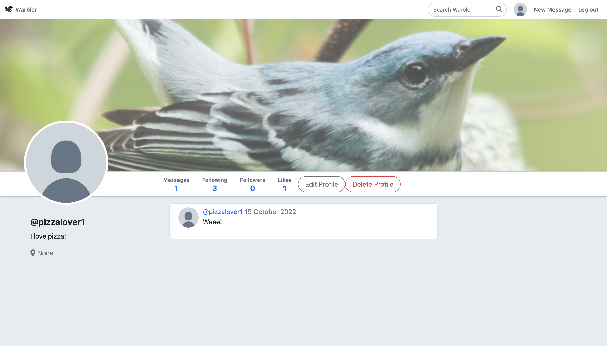

# warbler
Springboard Twitter clone project using Python, Flask, SQLAlchemy and tested using unittest.



## Features
- User authorization / authentication
- User can post messages
- User can follow others users and see their messages
- User search function 
- Option to edit profile

## To Run
```git clone``` this repo
- optional: python3 -m venv venv
- pip3 install requirements.txt
- flask run

## Testing
```python -m unittest FILE_NAME.py```
